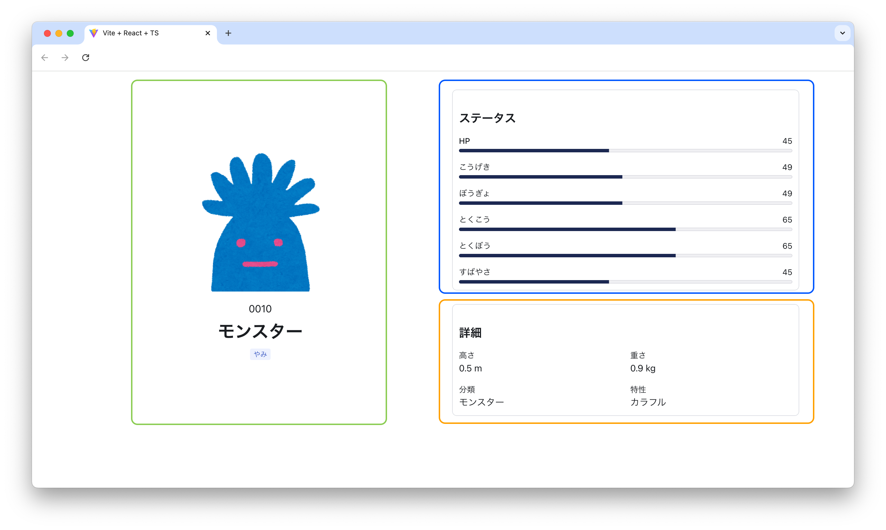

## My MFE

[vite-plugin-federation](https://github.com/originjs/vite-plugin-federation) を使ったマイクロフロントエンドプロジェクトのサンプル



## Setup

```
pnpm run build
```

```
pnpm run preview:details
pnpm run preview:overview
pnpm run preview:stats
```

```
pnpm run preview:app-shell
```
